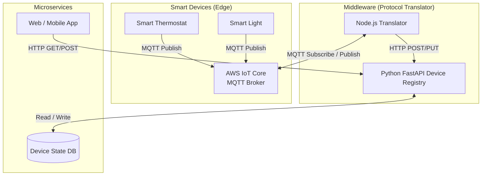
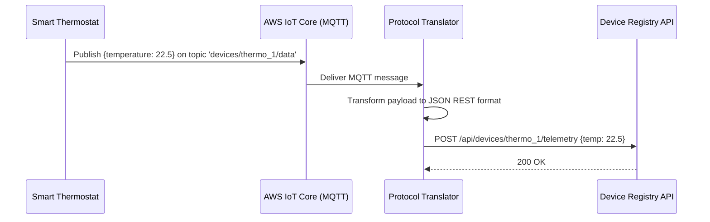

# SOA IoT Framework Architecture

## Topology Diagram

```mermaid
flowchart TD
    subgraph "Smart Devices (Edge)"
        Device1[Smart Thermostat] -->|MQTT Publish| AWSIoT[AWS IoT Core\nMQTT Broker]
        Device2[Smart Light] -->|MQTT Publish| AWSIoT
    end

    subgraph "Middleware (Protocol Translator)"
        Translator[Node.js Translator] <-->|MQTT Subscribe / Publish| AWSIoT
        Translator -->|HTTP POST/PUT| Registry[Device Registry API]
    end

    subgraph "Microservices"
        Registry[Python FastAPI Device Registry] <-->|Read / Write| DB[(Device State DB)]
        ClientApp[Web / Mobile App] -->|HTTP GET/POST| Registry
    end
```

## Sequence Diagram

```mermaid
sequenceDiagram
    participant Device as Smart Thermostat
    participant Broker as AWS IoT Core (MQTT)
    participant Translator as Protocol Translator
    participant Registry as Device Registry API

    Device->>Broker: Publish {temperature: 22.5} on topic 'devices/thermo_1/data'
    Broker->>Translator: Deliver MQTT message
    Translator->>Translator: Transform payload to JSON REST format
    Translator->>Registry: POST /api/devices/thermo_1/telemetry {temp: 22.5}
    Registry-->>Translator: 200 OK
```
